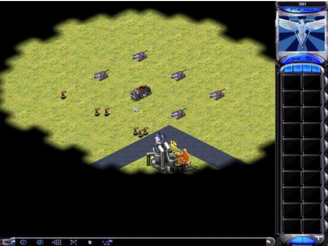

# Table of Contents
1. [Overview](#Overview)
2. [Problems](#Problems)
3. [The Concepts help to solve the problems](#The-Concepts-help-to-solve-the-problems)
4. [Case supported](#Case-supported)

# Overview

This is an original and exploring demo to analyze the Threat activity across the public blockchains. Here we focus on
on chain realtime threat activity matching and off chain threat intelligence data mining. We will provide simple demo
code to illustrate how to match these activities patterns, and also figure out what the challenges we usually encounter.

# Problems
In the cyberspace, We just like in the game "Red Alert," the map is shrouded in a lot of fog, allowing us to see only 
certain local areas. The connections between these areas are not clear. In the blockchain world, it is also not a trivial
to figure out the relationship between protocol, cex, dex, and the wallet address, and the multi public blockchains which
previous stuff based on.

- pre attack

Here we can generate Threat intelligence.

  - attacking

It is easy to find a short path pattern to detect the attack.Maybe before or after a successful attack

- post attack

In the post stage, we are busy to response the attack,and explore the previous short path pattern alert and initial threat intelligence.

# The Concepts help to solve the problems

## Signal
- One shot signal
One shot signal is a no ordinary event, it is a little suspicious event, but it is not enough to trigger the alert.

- Behavior signal
Behavior signal represented a series of events, but it is also not enough to trigger the alert. Behavior signal maybe generated by
some statistical methods, like the frequency, etc.

All these two types of signals are not enough to trigger the alert, but they are the basic building blocks of the alert.
These signals will be thought of as the input of the complex event processing. Do the pattern matching and trigger the alert.

## complex event processing (CEP)
Utilize the CEP to analyze the event sequence and match the pattern. We also could use other techniques to achieve this like:
- lag or lead function provided by Flink SQL
- Multi self table join
I have done it in Dune Sql.
- Native flink stream api like `interaljon` or `coGroup`

However, CEP also provide the same feature, and it is more flexible and programmable.

# Case supported

- [x] 1. Head and End address similar Phishing scam

